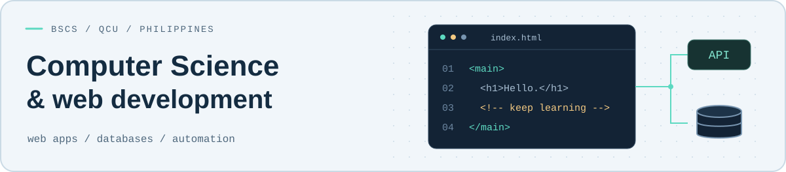

<picture>
  <source media="(prefers-color-scheme: dark)" srcset="assets/header-dark.svg">
  
</picture>

# Habib D. Jaudian

**BSCS student & aspiring software engineer** building practical web applications and automation tools in the Philippines.

[Projects](#featured-projects) · [Tech stack](#tech-stack) · [Learning](#currently-learning) · [Portfolio](https://my-portfolio.jaudianhabib879.workers.dev)

## About Me

I'm Habib, an 18-year-old, first-year Computer Science student at **Quezon City University**. I started with TVL-ICT Programming in senior high school and have a TESDA NC III Web Development background.

I enjoy building tools for everyday needs: class schedules, QR attendance, and workflows that connect web apps to spreadsheets. I'm working toward becoming a software engineer while strengthening my programming fundamentals. Outside of coding and classes, I play online games.

## Tech Stack

Technologies I've worked with as I learn and build. Each icon links to its documentation.

| Area | Technologies |
| --- | --- |
| **Languages** |  HTML &nbsp;  CSS &nbsp;  JavaScript &nbsp;  Java |
| **Frameworks / UI** |  Tailwind CSS &nbsp;  Bootstrap |
| **Backend / Database** |  PHP &nbsp;  MySQL |
| **Google / Automation** |  Google Apps Script &nbsp;  Google Sheets |
| **Development Tools** |  Git &nbsp;  GitHub &nbsp;  VS Code  XAMPP &nbsp;  Docker &nbsp;  PowerShell |

I use these in web applications, database-driven systems, API integrations, and JavaScript-based automation.

## Featured Projects

### [QCU Schedule](https://github.com/TsmHabib03/QCU-Schedule-Web-App)

A free student-focused web app for QCU: class schedules, Certificate of Registration (COR) information, campus locations, tasks, and notes in one place.

**Built with:** HTML, CSS, JavaScript, Google Apps Script, Google Sheets 
[Source code](https://github.com/TsmHabib03/QCU-Schedule-Web-App) · [Live app](https://qcu-schedule-web-app.pages.dev)

### [ASJ Attendance Checker](https://github.com/TsmHabib03/ASJ-Attendance-Checker)

A school attendance project with student QR check-ins, role-based dashboards, attendance monitoring, and report exports.

**Built with:** PHP, MySQL, JavaScript 
[Source code & screenshots](https://github.com/TsmHabib03/ASJ-Attendance-Checker#readme)

### [RepCore Fitness](https://github.com/TsmHabib03/Repcorefitness)

A gym membership and attendance system with camera-based QR check-ins, printable member cards, membership tracking, and a dashboard for recent activity.

**Built with:** PHP, MySQL, JavaScript 
[Source code & screenshots](https://github.com/TsmHabib03/Repcorefitness#readme)

<strong>Explore more: automation & Java projects</strong>

- **[QR Attendance System](https://github.com/TsmHabib03/QR-ATTENDANCE-SYSTEM)** — a web attendance app with Google Apps Script and Google Sheets for its backend, plus a local demo mode. **HTML, CSS, JavaScript, Apps Script, Sheets.**
- **[Event Registration with QR Tickets](https://github.com/TsmHabib03/Event-Registration-with-QR-Tickets-System)** — event registration and QR ticket check-in workflows. **JavaScript, Google Apps Script, Google Sheets.** [Live demo](https://event-registration-with-qr-tickets.vercel.app).
- **[Java To-Do List](https://github.com/TsmHabib03/To-Do-List-Java-)** — a desktop app for adding, completing, and removing tasks; practice with GUI components and object-oriented programming. **Java, Swing.**

## Currently Learning

- **Computer Science foundations:** programming fundamentals, data structures, algorithms, and object-oriented programming.
- **Backend development:** API design, database modeling, and reliable automation.
- **Software engineering practices:** readable code, debugging, testing, Git workflows, and cloud/web deployment.

## Education

**Bachelor of Science in Computer Science** — Quezon City University · First Year 
**Previous background:** TVL-ICT Programming · TESDA NC III Web Development

## GitHub

Browse my [public repositories](https://github.com/TsmHabib03?tab=repositories) and [contribution activity](https://github.com/TsmHabib03?tab=overview) for my latest work.

## Connect / Portfolio

[Visit my portfolio](https://my-portfolio.jaudianhabib879.workers.dev) · [Find me on GitHub](https://github.com/TsmHabib03)

<!-- Maintenance: update age, year level, and learning topics as they change. Keep project claims aligned with their source repositories. Local artwork and icon sources are documented in assets/README.md. -->
