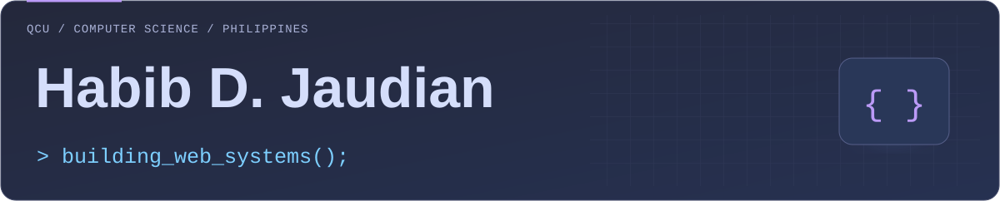
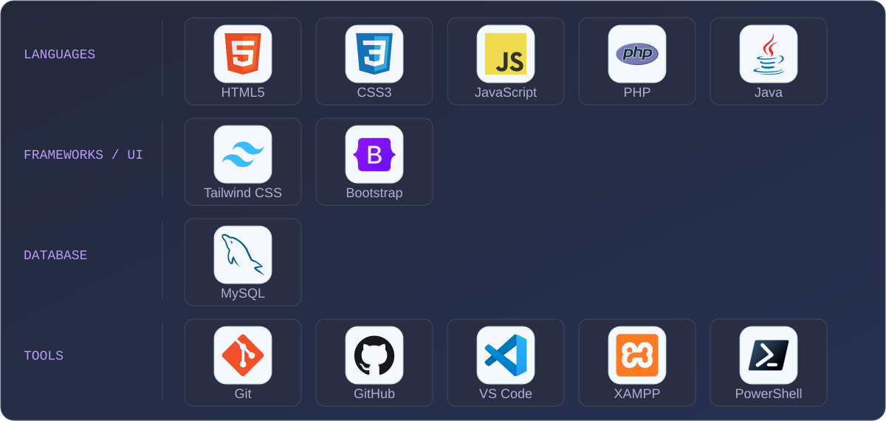
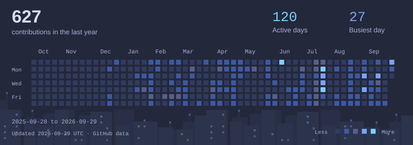
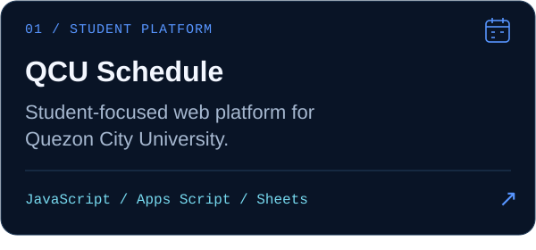
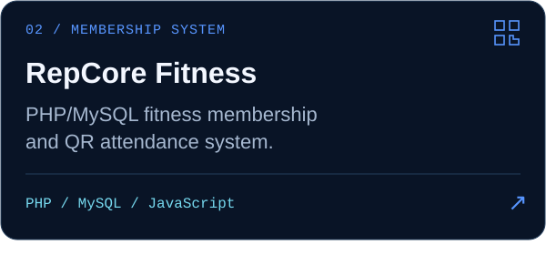
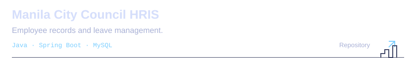

<h1 align="center">
  <picture>
    <source media="(max-width: 600px)" srcset="assets/hero-mobile.svg">
    
  </picture>
</h1>

  <strong>BSCS Student · Web Developer · Aspiring Software Engineer</strong> 
  Building practical web applications and software systems while studying Computer Science.

### Tech Stack

  <picture>
    <source media="(max-width: 660px)" srcset="assets/tech-stack-mobile.svg">
    
  </picture>

### GitHub Activity

<a href="https://github.com/TsmHabib03?tab=overview">
  <picture>
    <source media="(max-width: 600px)" srcset="assets/github-activity-mobile.svg">
    
  </picture>
</a>

Dated snapshot from GitHub data · <a href="https://github.com/TsmHabib03?tab=overview">Contribution activity</a>

### Featured Projects

  
  
  
  

<a href="https://my-portfolio.jaudianhabib879.workers.dev/">
  <picture>
    <source media="(max-width: 600px)" srcset="assets/portfolio-mobile.svg">
    
  </picture>
</a>
