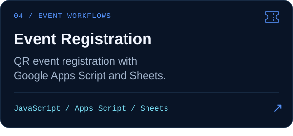

<picture>
  <source media="(max-width: 600px)" srcset="assets/hero-mobile.svg">
  
</picture>

<p align="center">
  Building practical web applications, software systems, and automation tools while studying Computer Science.<br>
  <sub>18 · First-year BS Computer Science · Quezon City University · Philippines<br>
  TVL-ICT Programming background · TESDA NC III Web Development</sub>
</p>

<picture>
  <source media="(prefers-reduced-motion: reduce) and (max-width: 600px)" srcset="assets/tech-stack-static-mobile.svg">
  <source media="(prefers-reduced-motion: reduce)" srcset="assets/tech-stack-static.svg">
  <source media="(max-width: 600px)" srcset="assets/tech-stack-mobile.svg">
  
</picture>

### // COMPUTER SCIENCE

<p>
  <sub>Developing through my BSCS studies and projects</sub><br>
  Programming · Data Structures · Algorithms · Databases · OOP · Web Systems · APIs · Software Engineering
</p>

### // WEB DEVELOPMENT

<p>
  <strong>Frontend</strong> &nbsp; HTML · CSS · JavaScript · Tailwind · Bootstrap<br>
  <strong>Backend</strong> &nbsp; PHP · MySQL · Google Apps Script<br>
  <strong>Systems</strong> &nbsp; REST APIs · QR Systems · Authentication · Automation · Database Applications
</p>

### // FEATURED PROJECTS

<p align="center">
  <a href="https://github.com/TsmHabib03/QCU-Schedule-Web-App"></a>
  <a href="https://github.com/TsmHabib03/Repcorefitness"></a>
  <a href="https://github.com/TsmHabib03/ASJ-Attendance-Checker"></a>
  <a href="https://github.com/TsmHabib03/Event-Registration-with-QR-Tickets-System"></a>
</p>

```text
CURRENTLY:
→ Studying Computer Science
→ Building full-stack web applications
→ Learning software engineering practices
→ Working with databases and APIs
→ Exploring automation and cloud deployment
```

<a href="https://my-portfolio.jaudianhabib879.workers.dev/">
  <picture>
    <source media="(max-width: 600px)" srcset="assets/portfolio-mobile.svg">
    
  </picture>
</a>

<p align="center">
  <sub>BSCS @ Quezon City University · Web Developer · Philippines<br>
  <a href="https://github.com/TsmHabib03">GitHub</a> · <a href="https://my-portfolio.jaudianhabib879.workers.dev/">Portfolio</a></sub>
</p>

<!-- Artwork, motion alternatives, licenses, and regeneration: assets/README.md. -->
