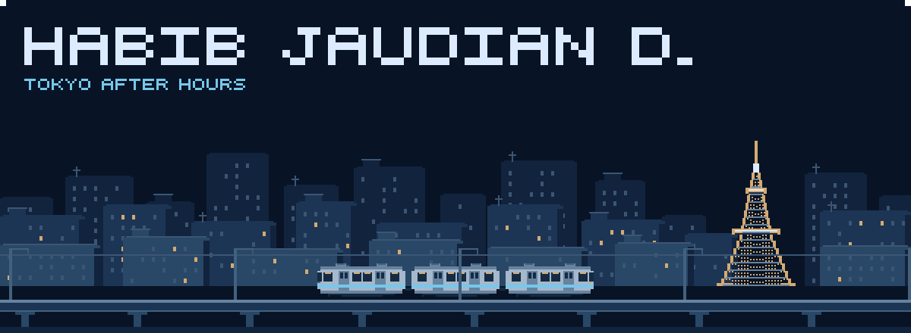

<h1 align="center">
  <picture>
    <source media="(prefers-reduced-motion: reduce) and (max-width: 600px)" srcset="assets/hero-mobile-still.svg">
    <source media="(prefers-reduced-motion: reduce)" srcset="assets/hero-still.svg">
    <source media="(max-width: 600px)" srcset="assets/hero-mobile.svg">
    
  </picture>
</h1>

## About Me

I'm **Habib**, a **BS Computer Science student** and web developer, working toward a career in software engineering. I build practical web applications for student tools, school attendance, membership management, and employee records.

## Current Focus

My project work centers on making everyday workflows easier to follow: organizing student information, connecting QR check-ins to attendance reports, and bringing membership and HR records into role-based dashboards.

## Tech Stack

### Languages

  &nbsp;JavaScript &emsp;
  &nbsp;PHP &emsp;
  &nbsp;Java

### Frontend

  &nbsp;HTML5 &emsp;
  &nbsp;CSS3

  &nbsp;Tailwind&nbsp;CSS &emsp;
  &nbsp;Bootstrap

### Backend and databases

  &nbsp;Spring&nbsp;Boot &emsp;
  &nbsp;MySQL

### Tools and development environment

  &nbsp;Git &emsp;
  &nbsp;GitHub

  &nbsp;VS&nbsp;Code &emsp;
  &nbsp;Docker

  &nbsp;Laragon

  &nbsp;Google&nbsp;Apps&nbsp;Script

## Featured Projects

- **[QCU Schedule](https://github.com/TsmHabib03/QCU-Schedule-Web-App)** — Schedules, notes, tasks, and campus tools in one student workspace. 
- **[ASJ Attendance Checker](https://github.com/TsmHabib03/ASJ-Attendance-Checker)** — A school research project for Academy of St. Joseph in Claveria, Cagayan: QR check-ins, role-based dashboards, and attendance reports.  
- **[RepCore Fitness](https://github.com/TsmHabib03/Repcorefitness)** — Gym memberships, QR attendance, expiry tracking, and email notifications.  
- **[Manila City Council HRIS](https://github.com/TsmHabib03/Manila-City-Council-HRIS)** — Employee records, leave approvals, and JasperReports PDF output for HR workflows.  

## Connect

<picture>
  <source media="(prefers-reduced-motion: reduce) and (max-width: 600px)" srcset="assets/section-connect-mobile-still.svg">
  <source media="(prefers-reduced-motion: reduce)" srcset="assets/section-connect-still.svg">
  <source media="(max-width: 600px)" srcset="assets/section-connect-mobile.svg">
  
</picture>

<a href="https://my-portfolio.jaudianhabib879.workers.dev/">&nbsp;Portfolio</a>

<a href="https://github.com/TsmHabib03">&nbsp;GitHub</a>

<a href="https://www.facebook.com/habib.jaudian.1">&nbsp;Facebook</a>

<a href="https://www.instagram.com/tsmhabib03?igsh=MWFoaTBnOXcxZ3dqdg%3D%3D">&nbsp;Instagram</a>

<a href="https://www.tiktok.com/@tsmhabib03?_t=ZS-8yESSirCSDC&amp;_r=1">&nbsp;TikTok</a>

<a href="mailto:jaudianhabib879@gmail.com">&nbsp;Email</a> jaudianhabib879@gmail.com

